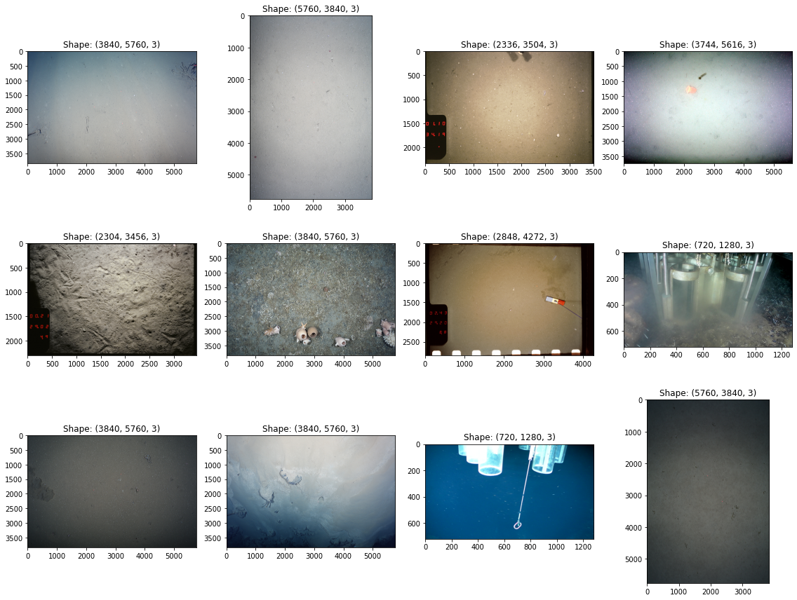

# Pangaea Downloader

This repository contains tools to search and download benthic habitat image datasets from [Pangaea](https://www.pangaea.de/).



### Run downloader
Run `pangaea_downloader/panquery-scraper.py` to download "seabed photograph" datasets from Pangaea.

The downloaded dataset files will be stored in the main project directory under `query-outputs`.


### Pre-commit setup

Pre-commit automatically sanitizes your code as you commit it.

To set up the pre-commit hook, run the following code:

```
pip install -r requirements-dev.txt
pre-commit install
```

Whenever you try to commit code which needs to be modified by the commit hook, you'll have to add the commit hooks changes and then redo your commit.

You can also manually run the pre-commit stack on all the files at any time:

```
pre-commit run --all-files
```
